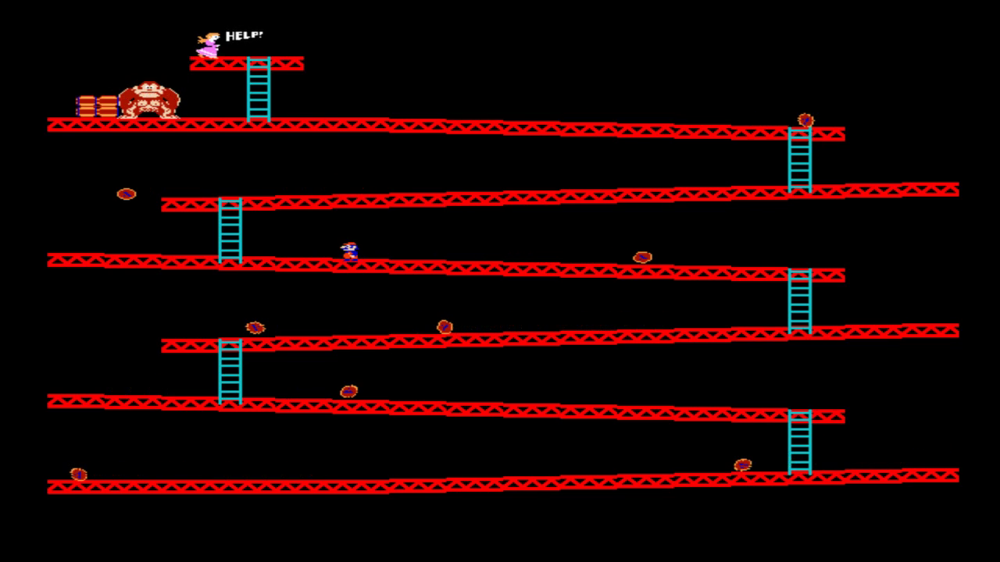

# Donkey-Kong-C++-
A Donkey Kong game written in C ++ with SDL.

About the game
==============
It's a small personal project based on the original Donkey Kong game released in 1981.

It was written in C ++ using smart pointers, a simple template-based object pool, and  
in general the good C ++ standards (at least the ones I know of).
I used the SDL library for rendering.

There are a gameplay video on Youtube: https://youtu.be/_Fgp9DIq6dc
